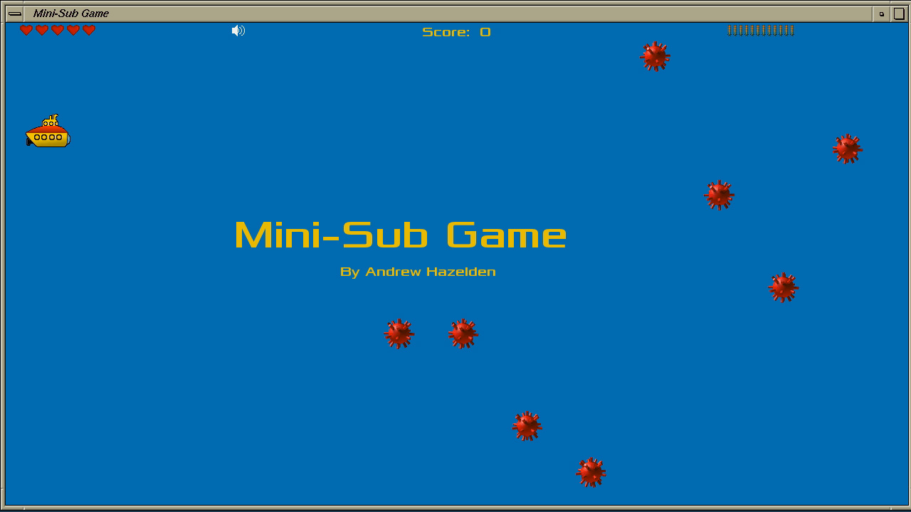

#Sub Game for IRIX/Mac/Linux V1.0  
*Created by Andrew Hazelden*  
* * *
email: [andrew@andrewhazelden.com](mailto:andrew@andrewhazelden.com)  
web: [www.andrewhazelden.com/blog](http://www.andrewhazelden.com/blog)  
* * *

##Game Descripton
In the Mini-Sub game you have navigate a dangerous ocean filled with sea mines. You can use your torpedoes to clear a path through the mine field. Along the way you can pickup extra lives and more torpedoes.

The red sea mines take 1 torpedo hit to detonate and the grey sea mines take 2 torpedo hits to detonate.

##Controls
The yellow mini-sub is controlled by the cursor keys. 
Press the spacebar to fire a torpedo.

Press the TAB key to switch between fullscreen mode and windowed mode
Press the ESC key to quit the game.
Press the m key to mute the audio soundtrack.

You can change the game resolution from the command line:

To switch the display to 1024x768 in fullscreen mode:  
`./irix_mini-sub --window 1024 768 -fullscreen`

To run the game at 1280x720 in windowed mode:  
`./irix_mini-sub --window 1024 768`

`Usage: mini-sub [options]  
Options:  
  --window <width> <height> [-fullscreen]  
    Set the size of the main window`  

##Screenshots

##Version History
Version 1.0 Released Jan 29, 2013   
This is the first version of the Mini-Sub game released for IRIX/Mac/Linux. It was created for the Winter Warmup 2013 RetroChallenge. This game is based upon the open source Mini-Sub game demo created for the Mikromedia dsPIC33 16-bit embedded computer.

##IRIX Notes:
The IRIX executable is called "irix_mini-sub". You need to have SDL installed for it to work on IRIX. You can download `SDL, libsdl_image, libsdl_mixer,  libsdl_gfx-framework, and libsdl_ttf` from Nekoware.

The IRIX version of the mini-sub game can be compiled with GCC on IRIX 6.5.

To compile it on IRIX run:  
`cd "Mini-Sub/source_code"`   
`make -f Makefile.irix go`

Main Nekoware Page:  
[http://www.nekochan.net/what-is-nekowar.html](http://www.nekochan.net/what-is-nekowar.html)

Primary Nekoware Mirror:  
[http://nekoware.dustytech.net/index.php?path=current/](http://nekoware.dustytech.net/index.php?path=current/)

##Mac Notes:
For the Mac alpha version you need to start it from the command line so the program knows where the image resources are. If you double click on the file mac_mini-sub file you will get an error. I am working on improving my SDL image loading code to fix this issue.

To start the game enter the following at the terminal:  
`cd "Mini-Sub/game"`  
`./mac_mini-sub`  

To compile it on Mac OS X run:  
`cd "Mini-Sub/source_code"`  
`make -f Makefile.osx go`  

You can install the required SDL libraries using Mac Ports and xcode:  
[http://www.macports.org/install.php](http://www.macports.org/install.php)

With Mac Ports installed run the following command from the terminal:  
`sudo port install libsdl-framework libsdl_image-framework libsdl_mixer-framework libsdl_gfx-framework  libsdl_ttf-framework` 

##Linux Notes:
The Linux executable is called "linux_mini-sub". You need to have SDL installed for it to run on Linux. 

To compile the game on Linux run:  
`cd "Mini-Sub/source_code"`  
`make -f Makefile.linux go` 

You can use YUM to install the SDL graphics libraries with the help of the EPEL repository:  
[http://fedoraproject.org/wiki/EPEL](http://fedoraproject.org/wiki/EPEL)

If you are running Centos 6.3 you can use this package to automatically add the EPEL repo to YUM:  
[http://fedora.mirror.nexicom.net/epel/6/i386/repoview/epel-release.html](http://fedora.mirror.nexicom.net/epel/6/i386/repoview/epel-release.html)

With EPEL installed run the following command from the terminal:  
`yum install gcc SDL-devel SDL_image-devel SDL_mixer-devel SDL_gfx-devel SDL_ttf-devel` 

--------------------------------

Copyright (c) 2013 Andrew Hazelden. 

The Mini-Sub game is released under a Creative Commons Attribution Non-commercial Share Alike (by-nc-sa) license:  
[http://creativecommons.org/licenses/by-nc-sa/3.0/deed.en_US](http://creativecommons.org/licenses/by-nc-sa/3.0/deed.en_US)

The Mini-Sub game uses the display font "Xolonium" which is licensed under the GPL 2.0 license.

The Mini-Sub game uses the soundtrack "Gameboy" by Pavese from the album "Best of Tony-B Machine" which is licensed under the Creative Commons Attribution Non-commercial Share Alike (by-nc-sa) license:  
[http://creativecommons.org/licenses/by-nc-sa/3.0/](http://creativecommons.org/licenses/by-nc-sa/3.0/)

